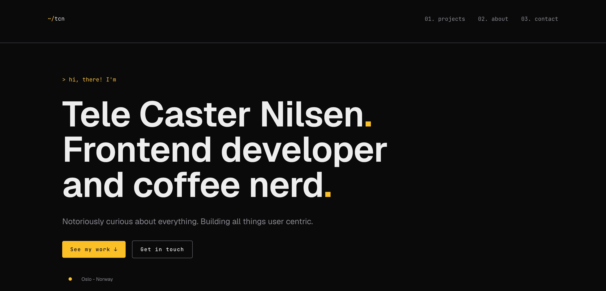

# Tele Caster Nilsen - Portfolio 2

The last course at Noroff School of Technology and Media



**Live site:** [tcn.telecasternilsen.com](https://tcn.telecasternilsen.com)<br/>
**Author:** Tele Caster Nilsen

## Introduction

Welcome to my portfolio site. Created as a part of the course PORTFOLIO 2, in the second year at Noroff School of Techonology and Media. This website is a presentational site showcasing 3 of my projects during my school years.

### Simple Navigation

The site is a static multiple-pages site, with link navigation to unique project pages.

#### Technologies

- Vite, React, React Router, Typescript, Tailwind

#### Styling

`index.css`

- Tailwind CSS variables mapped to style-guide

#### Visual architectural hierarchy

```bash
# "/"
HEADER
    HOME
    - Hero
    - Projects
        - ProjectDetails
    - About
    - Contact
FOOTER

# "/projects/:slug"
HEADER
    PROJECT
    - ProjectDetails
FOOTER
```

## Installation

### Step 1: Clone the Repository

```bash
git clone https://github.com/telecasteren/portfolio2.git
cd portfolio2
```

### Step 2: Install Dependencies

Run the following command in the terminal:

```bash
pnpm install
```

This will install the required dependencies for the site, including the build tool and any necessary plugins.

### Step 3: Build the Site

Run the following command to build the site:

```bash
pnpm build
```

This will compile the HTML, CSS, and JavaScript files and create a production-ready version of the site.

### Step 4: Start the Server

Run the following command to start the site's development server:

```bash
pnpm dev
```

This will start the site in dev-mode and allow you to access it at `http://localhost:5173` in your web browser.

Or preview production with current local version:

```bash
pnpm build # build for production first
pnpm preview
```

This will start the site and allow you to access it at `http://localhost:4173/` in your web browser.

### AI LOG

AI can be used in this project to:

- Brainstorming architecture strategy/structure
- Create boilerplate / placeholder texts
- Explaining concepts/rubberducking/debug assistance
- Improve wording in project descriptions or reflections etc.

_All AI usage is logged and can be found in [AI_LOG.md](AI_LOG.md)._

## Acknowledgments

This portfolio site was built using the following tools and libraries:

- [React](https://reactjs.org/) frontend
- [Tailwind](https://tailwindcss.com) styling

### Resources

- React Router Data Mode [docs](https://reactrouter.com/start/data/routing#routing)
- My hobby portfolio [url](https://telecasternilsen.com)
- React Meta [docs](https://react.dev/reference/react-dom/components/meta#usage)
